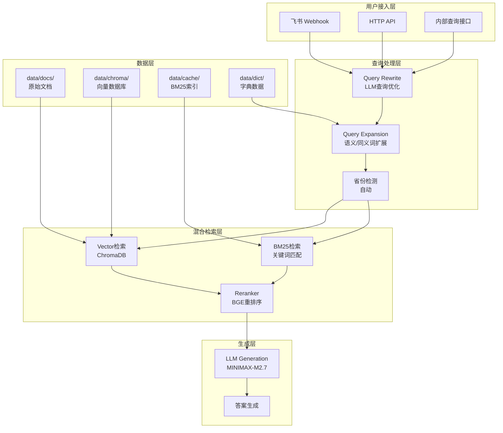
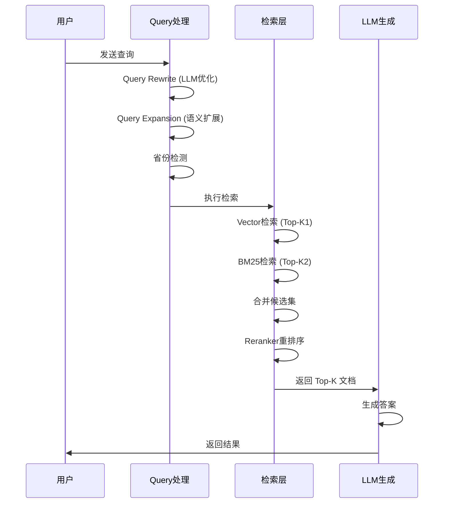
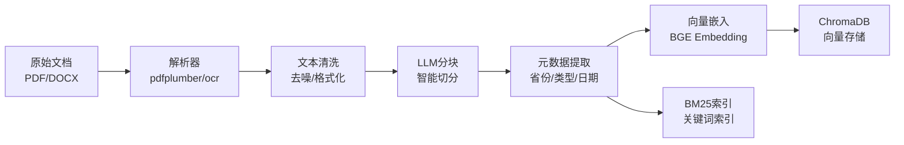

# 电力政策知识问答系统

基于 RAG 技术的电力政策知识问答系统，支持飞书机器人集成，提供多省份政策文档检索和智能问答服务。

## 项目简介

本项目采用混合检索架构（Vector + BM25 + BGE Reranker），支持 LLM 查询重写和语义扩展，并通过 RAGAS 框架进行效果评估。

**主要应用场景**：
- 电力市场交易政策咨询
- 多省份政策对比查询
- 企业合规政策解读
- 飞书机器人智能客服

**技术栈**：FastAPI + LangChain + ChromaDB + GLM-4 / BGE Embedding

## 系统架构

### 整体架构图



### 处理流程图



### 核心组件说明

| 组件 | 功能 | 模型/技术 |
|------|------|-----------|
| Query Rewrite | LLM驱动查询优化，提升检索相关性 | MINIMAX-M2.7 |
| Query Expansion | 语义/同义词扩展，增强召回率 | synonyms.json + semantic |
| Hybrid Retrieval | Vector + BM25 双路召回 | ChromaDB + BM25 |
| Reranker | 精排序，筛选最相关文档 | BAAI/bge-reranker-large |
| LLM Generation | 答案生成 | MINIMAX-M2.7 |

## 快速开始

### 环境准备

```bash
# 克隆项目
git clone <repo_url>
cd firstmodel

# 创建虚拟环境（可选）
python -m venv .venv
.venv\Scripts\activate  # Windows
# source .venv/bin/activate  # Linux/Mac

# 安装依赖
pip install -r requirements.txt
```

### 配置说明

```bash
# 复制环境配置模板
cp .env.example .env

# 编辑 .env 配置必要参数
# 主要配置项：
# - GLM_API_KEY: 智谱AI API密钥（必需）
# - EMBEDDING_MODEL: 向量嵌入模型路径
# - CHROMA_PATH: 向量数据库路径
```

### 启动服务

```bash
# 开发模式（带热重载）
uvicorn app.main:app --reload --host 0.0.0.0 --port 8000

# 生产模式
uvicorn app.main:app --host 0.0.0.0 --port 8000 --workers 4
```

## 核心功能

### 智能检索

- **Query Rewrite**: LLM驱动的查询优化，支持保留原始查询、最小长度阈值控制
- **Query Expansion**: 语义扩展、同义词扩展，最大扩展数量可配置
- **Hybrid Retrieval**: 向量检索 + BM25 + BGE Reranker 三阶段检索，可配置各阶段 Top-K

### 多省份支持

- 省份隔离的知识库（每省独立 Chroma collection）
- 省份+全局混合检索模式
- 自动省份检测（置信度阈值可配置）
- 低置信度时触发确认流程

### 飞书集成

- 实时消息处理
- Webhook 验证（Token + Signature）
- 事件去重
- 错误告警推送

### 效果评估

- RAGAS 指标（faithfulness, answer_relevancy, context_precision）
- 批量评估 API
- A/B 对比工作流
- 17项核心指标追踪

## 目录结构

```text
firstmodel/
├── app/                        # 核心应用
│   ├── api/                    # API路由
│   │   ├── routes_query.py     # 查询接口
│   │   ├── routes_metrics.py   # 指标接口
│   │   └── routes_evaluation.py # 评估接口
│   ├── core/                   # 核心模块
│   ├── db/                     # 数据库模型
│   ├── langchain/              # LangChain组件
│   │   ├── hybrid_retriever.py # 混合检索器
│   │   └── orchestrator_hybrid.py # 编排器
│   ├── schemas/                # 数据模型
│   ├── services/               # 业务服务
│   └── utils/                  # 工具函数
├── dataprocess/                # 数据处理管道
│   ├── pipeline.py             # 文档处理主流程
│   ├── parsers/                # PDF/DOCX解析器
│   └── chunkers/               # LLM智能分块
├── evaluation/                 # 评估系统
│   ├── run_eval.py             # CLI评估入口
│   ├── benchmark.json          # 测试基准问题
│   ├── experiments/            # 实验数据
│   └── reports/                # 评估报告
├── tests/                      # 测试文件
├── tools/                      # 工具脚本
│   ├── offline_ingest.py       # 离线导入工具
│   ├── smoke_rag.py            # 快速测试工具
│   └── tessdata/               # OCR语言数据
├── scripts/                    # 辅助脚本
├── docs/                       # 文档
├── data/                       # 数据存储
│   ├── docs/                   # 原始政策文档（按省份）
│   │   ├── global/             # 全国政策
│   │   ├── SN/                 # 陕西
│   │   ├── SX/                 # 山西
│   │   └── GS/                 # 甘肃
│   ├── chroma/                 # 向量数据库
│   ├── cache/                  # BM25索引缓存
│   ├── dict/                   # 字典数据
│   │   ├── stopwords.txt       # 停词表
│   │   ├── synonyms.json       # 同义词
│   │   └── power_policy.txt    # 领域词典
│   └── processed/              # 处理后数据
│       └── SN/_manifest.json   # 处理记录
├── .env.example                # 环境配置模板
├── .gitignore                  # Git忽略规则
├── README.md                   # 项目说明
└── requirements.txt            # 依赖列表
```

## API接口

### 查询接口

| 端点 | 方法 | 说明 |
|------|------|------|
| `/query` | POST | 内部查询端点 |
| `/feishu/webhook` | POST | 飞书回调端点 |

### 管理接口

| 端点 | 方法 | 说明 |
|------|------|------|
| `/admin/health` | GET | 服务健康状态 |
| `/admin/ingest` | POST | 导入文档（需启用） |

### 指标接口

| 端点 | 方法 | 说明 |
|------|------|------|
| `/metrics` | GET | 实时性能摘要 |
| `/metrics/history` | GET | 历史性能统计 |
| `/metrics/errors` | GET | 错误统计 |
| `/metrics/province` | GET | 省份查询分布 |
| `/query/trace/{trace_id}` | GET | 查询详细追踪 |

### 评估接口

| 端点 | 方法 | 说明 |
|------|------|------|
| `/evaluation/recent` | GET | 最近评估记录 |
| `/evaluation/summary` | GET | 评估指标汇总 |
| `/evaluation/run` | POST | 手动触发批量评估 |
| `/metrics/ragas` | GET | RAGAS指标趋势 |

## 开发指南

### 本地开发

```bash
# 启动开发服务
uvicorn app.main:app --reload

# 查看API文档
# http://localhost:8000/docs
# http://localhost:8000/redoc
```

### 运行测试

```bash
# 运行所有测试
pytest tests/

# 运行特定测试
pytest tests/test_retriever.py -v

# 运行覆盖率测试
pytest tests/ --cov=app
```

### 添加新省份

1. 在 `data/docs/` 下创建省份目录（如 `GD/`）
2. 放入政策文档（PDF/DOCX）
3. 运行离线导入：
   ```bash
   python tools/offline_ingest.py --kb-scope province --province-code GD --dedupe true
   ```
4. 更新 `app/config.py` 中的 `PROVINCE_DEFAULT`

### 调试技巧

```bash
# 快速验证RAG功能
python tools/smoke_rag.py --query "陕西电力交易规则"

# 查看向量数据库状态
python -c "from app.core.vector_store import get_collection_info; print(get_collection_info('SN'))"
```

## 部署说明

### 生产环境配置

```env
# 必需配置
GLM_API_KEY=<your_api_key>
EMBEDDING_MODEL=BAAI/bge-small-zh-v1.5
CHROMA_PATH=./data/chroma

# 性能配置
TOP_K=8
HYBRID_VECTOR_TOP_K=15
HYBRID_BM25_TOP_K=15
RERANK_TOP_K=8

# 安全配置
INGEST_ENABLED=false
FEISHU_ALERT_ENABLED=true
```

### 离线数据导入

```bash
# 导入省份知识库
python tools/offline_ingest.py --kb-scope province --province-code SN --dedupe true

# 导入全局知识库
python tools/offline_ingest.py --kb-scope global --dedupe true --rebuild true

# 查看导入状态
python tools/offline_ingest.py --status
```

### 服务启动

```bash
# 生产环境启动
uvicorn app.main:app --host 0.0.0.0 --port 8000 --workers 4

# Docker启动（可选）
docker build -t power-policy-qa .
docker run -p 8000:8000 power-policy-qa
```

### 性能调优

- 调整 `HYBRID_VECTOR_TOP_K` 和 `HYBRID_BM25_TOP_K` 平衡召回率与延迟
- 启用 `RERANKER_PRELOAD=true` 减少首次请求延迟
- 配置 `FEISHU_MAX_WORKERS` 控制飞书并发处理数

## 数据处理流程

### 文档导入流程



### 向量索引构建

```bash
# dataprocess模块处理流程
python -m dataprocess.pipeline --input data/docs/SN --output data/processed/SN

# 处理步骤：
# 1. 文档解析 -> 提取文本
# 2. LLM分块 -> 智能切分
# 3. 元数据提取 -> 省份/类型/来源
# 4. 向量嵌入 -> BGE Embedding
# 5. Chroma存储 -> 向量索引
```

### BM25索引构建

BM25索引在离线导入时自动构建，存储在 `data/cache/` 目录：
- `bm25_sn.pkl` - 陕西BM25索引
- `bm25_global.pkl` - 全局BM25索引

## 评估系统

详细文档请参阅 [evaluation/README.md](evaluation/README.md)

### 快速评估命令

```bash
# 生成测试问题集
python evaluation/run_eval.py generate --docs-path data/docs/SN --output evaluation/benchmark.json --count 100

# 运行评估
python evaluation/run_eval.py run --benchmark evaluation/benchmark.json --ragas --save-db

# A/B对比
python evaluation/run_eval.py compare eval_001 eval_002
```

### RAGAS指标说明

| 指标 | 说明 | 目标值 |
|------|------|--------|
| faithfulness | 答案与上下文一致性 | > 0.85 |
| answer_relevancy | 答案与问题相关性 | > 0.80 |
| context_precision | 检索上下文精确度 | > 0.75 |

## 配置参数速查

### 核心配置

| 参数 | 默认值 | 说明 |
|------|--------|------|
| `EMBEDDING_MODEL` | BAAI/bge-small-zh-v1.5 | 向量嵌入模型 |
| `TOP_K` | 8 | 最终返回文档数 |
| `CHROMA_PATH` | ./data/chroma | 向量数据库路径 |

### 检索配置

| 参数 | 默认值 | 说明 |
|------|--------|------|
| `HYBRID_VECTOR_TOP_K` | 15 | 向量检索候选数 |
| `HYBRID_BM25_TOP_K` | 15 | BM25检索候选数 |
| `BM25_K1` | 1.5 | BM25词频饱和度 |
| `BM25_B` | 0.6 | BM25长度归一化 |
| `RERANK_TOP_K` | 8 | 重排序返回数 |

### Query处理配置

| 参数 | 默认值 | 说明 |
|------|--------|------|
| `QUERY_REWRITE_ENABLED` | true | 启用查询重写 |
| `QUERY_EXPANSION` | true | 启用查询扩展 |
| `QUERY_EXPANSION_METHOD` | semantic | 扩展方法 |
| `QUERY_EXPANSION_MAX` | 3 | 最大扩展数 |

## 常见问题

**Q: 服务启动后查询返回空结果？**
A: 检查 `data/chroma/` 目录是否存在向量数据，运行离线导入：
```bash
python tools/offline_ingest.py --status
```

**Q: 如何添加新的政策文档？**
A: 将文档放入对应省份目录，运行离线导入：
```bash
python tools/offline_ingest.py --kb-scope province --province-code SN
```

**Q: 飞书机器人无法接收消息？**
A: 检查飞书配置（`FEISHU_APP_ID`, `FEISHU_APP_SECRET`）和Webhook验证。

**Q: OCR功能如何启用？**
A: 安装Tesseract并配置：
```env
OCR_ENABLED=true
TESSERACT_CMD=C:/Program Files/Tesseract-OCR/tesseract.exe
TESSDATA_PREFIX=./tools/tessdata
```